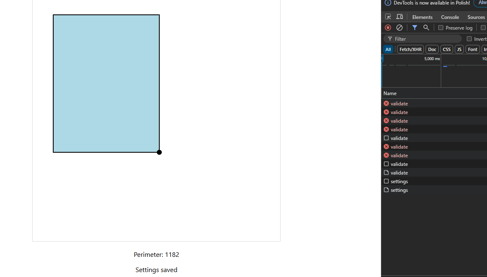

This is basic app that allows user to manipulate SVG rectangle on user's screen




.NET Minimal API was used to receive and handle HTTP calls, it allows user to read/write/validate width/height of the rectangle

React was used as frontend - it draws rectangle on screen and allows user to change its width and height.
If user changes those values request is sent to an API to validate width and heigt and if values met condition that height is bigger than width - then second request is made to persist new settings.
Artificial delay of 10 seconds was added to validation. If user starts changing dimensions of rectangle before validation finishes - first request will be cancelled and new request shall be invoked

To run app you have to:

Install latest LTS .NET SDK (at least 8.0)
Go to /api and invoke 

`dotnet run` 

that should restore packages, build and run api on localhost:5244

For front end install latest LTS NodeJS with npm 
Go to /app directory and invoke 

```
npm install
npm start
```


(you might need to set env variable before `$env:NODE_OPTIONS = "--openssl-legacy-provider"`)

(you might also need to set npm config to allow legacy peer deps `npm config set legacy-peer-deps true`)

This should run frontend on 3000 port

API url is hardcoded in index.tsx - if you changed it make sure it was updated there.
If React app port was changed from 3000 to another - in Program.cs CORS were hardcoded and needs to be adjusted  